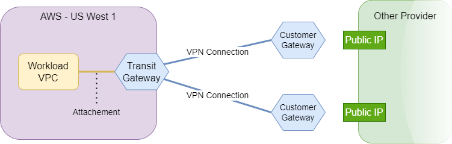
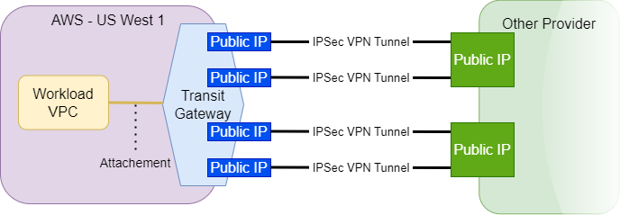
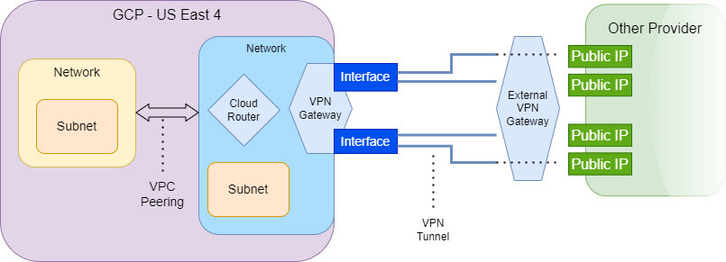
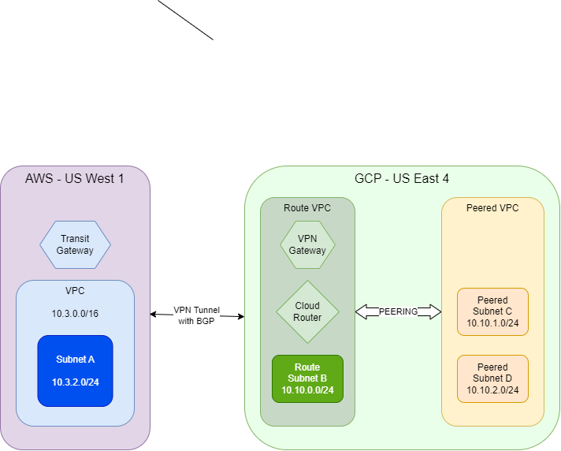

# Cloud Service Provider Connector

The connector package provides a CLI for establishing a connection
between two Cloud Service Providers.

Currently, the CSP Connector supports 3 providers:
* AWS
* Azure
* GCP

The CSP Connector uses Bolt DB to store information about existing
connections. Every internal interaction with the database will load
or create `connections.db` file in the location from where the binary
was run.

# Usage

The CSP connector focuses mainly on 4 operations

1. Connect - establishes or refreshes a connection between two gateways
1. Disconnect - removes the existing connection between two gateways
1. List gateways - lists all available gateways
1. List connections - lists existing connections in the database

## Connect

Creates a connection between two Gateways or attempts to recreate it
if the connection is in invalid state (for example due to sudden
`connect` interrupt).

The connection can be created using either a file:

```
./cspConnector connect --from-file examples/request.yaml
```

specifying an ID of the connection (also known as connection recreation):
```
./cspConnector connect --src-id azres-vnet-gw --dest-id tgw-0427f8218cee37a2e --src-provider azure --dest-provider aws
```

or specifying connections manually: 
```
./cspConnector connect --connection-id 551fcc0a-774d-4bbb-aef0-8335e808e1c3
```

The last option doesn't require providing all informations about single side.
At least one need to be provided (either id, region or provider). If the
information results in multiple gateways detected, more specific information
needs to be provided.

If multiple methods are provided (for example --from-file and --connection-id)
the order seen above takes precedence (file, connection-id, connection-details).

The connection between providers is bidirectional - specifying a single
gateway as source or destination is not crucial. It only matters if
both sides will generate their own BGP Addresses - in that scenario,
the source connection will be the one starting - other than that, there
is really no difference.

To check the details of available gateways run `list gateways` to see
which Gateways can be used.

The connect method creates an entry in the local database with the
information about the status of connection being created. To see those
entries run `list connections`.

## Disconnect

Destroys the connection between two Gateways.

```
./cspConnector disconnect --from-file
```

Disconnect method accepts the same arguments as connect method.
The user can specify

* Connection ID
* Connection Details

Specifying Connection ID does a look up in the database and removes
requested connection but the same thing can be achieved through
Connection Details. Currently, each provider analyzes resource
ownership based on their names/tags.

The successful erase of connection will remove the entry from the
database.

## List gateways

Goes through available and authenticated providers and list Gateways
provided by them.

## List connections

Lists all connections that are either active, are in the progress of
creation/deletion or failed at some stage.

As opposite to other commands, listing connections doesn't require
access to any Cloud Provider. It entirely relies on the Bolt DB file.

If the `connections.db` file doesn't exist in the current location,
listing connections will create a new database file and provide empty
list of connections.

Similarly, getting/listing options should provide `-o format` option
to allow generating JSON/YAML responses and somehow hide logs (they
can be uncovered with `--debug` option or something similar).

## Missing operations

The list operation should involve filtering options.

Additionally, a get operation needs to be implemented which would
provide more detailed information about particular Gateway with
provider specific details (resource group for Azure for instance).

# Terminology

## Gateway

The CSP Connector uses term Gateway to name a group of resources
which is required to establish a connection with their provider.

# Provider

Each provider defines a client for interacting with the actual Cloud
Service Provider in order to:

* get existing resources to learn about available gateways and
    existing connections

* create necessary resources to establish a connection with other
    provider's gateway

* delete resources to remove existing connection

## Existing providers

Currently, there are 3 available providers implemented.

### AWS



As for the AWS, we use `Transit Gateway` to mark a potential CSP Gateway.

Transit Gateway can be used to establish a connection between AWS VPCs in
different regions, but it also allows setting a connection with On Premise
server or different provider.

In order to establish a connection, we create a `Customer Gateway` for
each public IP from the second CSP Gateway. Then we create `VPN Connections`
which connect our `Transit Gateway` with created `Customer Gateways`.

Underneath, each VPN Connection will result in 2 VPN Tunnels



Which means that AWS creates twice as many VPN Tunnels as there are Public
Interfaces from the second Gateway.

Important thing to know is that AWS assigns public IPs to the Transit
Gateway during creating `VPN Connection` resource between it and a Customer
Gateway. However, a Customer Gateway requires specifying Public IP Address
associated with the other gateway's interface. For that matter, establishing
a connection between AWS and the second side requires that second side to
share its public interfaces first so AWS can create necessary resources and
as a result create its own Public Interfaces.

The CSP Connector does not specify any special rules for such
scenario because the issue is mitigated due to AWS BGP
Addressing.

#### BGP

In order to establish a BGP Session, each VPN Tunnel should
have two IP Addresses for exchanging Route Tables:

* IP Address - the IP Address of the BGP interface for
    the Gateway

* Peer IP Address - the IP Address of the BGP interface for
    the second side of connection

The thing about AWS is that these IP Addresses cannot be
fully customized. The AWS allows providing a CIDR for each
VPN Tunnel which will be used to generate IP Addresses for
BGP. After that, AWS will generate pair of IP addresses -
IP Address of BGP session for VPN Tunnel on the AWS side and
an IP Address for the second side of connection.

AWS assumes that the second provider will use the BGP IP
Address provided by the AWS as its own.

Because of that, creating connection between AWS and anything
else requires AWS to be the first one in the chain as in result
we finally get details of AWS Gateway including:

* Public Interfaces
* BGP Addresses for each VPN Tunnel
* Peer BGP Addresses for each VPN Tunnel

If the second side of connection wants to have a BGP Session
with AWS, it needs to assign these Peer BGP Addresses from
AWS as its own BGP Addresses.

#### Transit Gateway Routes

TODO: Describe TGW routes how they can be used for VPC RT

### GCP



To create a VPC Connection between GCP VPC and other provider's
VPC one could create VPN Gateway inside that GCP VPC and
optionally Cloud Router (for dynamic routing) and create a direct
VPN Tunnel between that Network and some other VPC. It would
work but relying on such approach would require creating VPN
Gateway for every VPC from GCP we would like to connect. The
need for a Gateway which could be shared with multiple VPCs
guided us to the solution described below.

The GCP Provider considers a gateway to be a set of the
following resources:

* Cloud Router - Responsible for exchanging information
    about routes within the GCP and with other sides of
    connection

* VPN Gateway - The actual Gateway responsible for
    creating VPN Tunnels.

* Peering Network - The Network which is needed by Cloud
    Router and VPN Gateway. It will act as a peering
    Network

As Gateways in CSP Connector are not a part of internal
Database yet, the Gateway described above is identified
by the Cloud Router resource.

It is expected that VPN Gateway exists within the same
Network as Cloud Router.

Peering Network is supposed to act as a Gateway Network.
When there is a request to establish a VPC Connection
between AWS/Azure VPC and a certain GCP VPC, the CSP
should check for an existing Cloud Connection, track
the GCP Gateway used for the connection, pick its
Peering Network and create a VPC Peering between that
network and the network we want to connect with other
provider.

This solution has one drawback - route propagation.

#### Route Propagation

The route propagation is handled with the help of BGP
sessions and Cloud Router.

The Cloud Router automatically learns all subnets, that
are a part of the underlying network and propagates their
subnet CIDRs as routes to the other side of connection
using the BGP Session.



The problem is that
**subnets that are a part of Peered Networks must be**
**added manually to the Cloud Router in order to be**
**propagated.**

The big advantage of having Cloud Router and VPN Gateway
inside the VPC, we want to connect, is that the BGP
Session will automatically collect information about
existing subnets within that Network and advertise proper
routes over that BGP Session to other sides of connection.

### Azure

TODO: Describe os.getenv for getting Azure Subscription ID and specifying Resource Group in Config while listing resources

TODO: Describe Azure

## Provider implementation

Right now, each provider's implementation has the following code
architecture:

```
- client/
---- client.go
---- types.go
---- helper.go
- provider.go
- helper.go
```

The goal behind that design is to create a separation between CSP
Connector's business code and the actual provider's SDK. The `Client`
package should define code interacting with SDK and translating
CSP Structures from and to SDK structures. It provides the following
benefits:

* transaction middle point - Each GET/CREATE/UPDATE/DELETE action
    goes through Client package instead of being spread across
    multiple files in the business code. Thanks to that:

    * adding resource cache can be achieved inside this package

    * it is easier to track every created/updated/deleted
        resource which gives the option to specify a list of
        resources that were created during handling certain
        request

* structure simplification - SDK structures define deeply nested
    fields (especially for BGP Configurations) and CSP Connector
    business code does not need that level of nesting so our
    structure flattens them. Additionally, most of fields are
    hidden behind pointers, usually for updating purposes - if
    the field is a nil then it should be omitted from updating
    (allowing provider to define PATCH methods) - due to that
    each field lookup needs to be preceed with checking if it
    is not nil - our structures remove pointers where they are
    not necessary - however, if we need to distinguish updated
    fields from not updated fields, we can add pointers for such
    fields and define following methods:

    ```
    type TransitGateway struct {
        ...
        Name    *string
    }

    func (t *TransitGateway) GetName() string {
      if t == nil {
        return ""
      }
      if t.Name == nil {
        return ""
      }
      return *t.Name
    }
    ```

    Above example is for demonstration only but it gives the idea.

## Adding new provider

The CSP Connector is being developed with a focus on making a new providers
easy. Defining a new provider means adding a new structure implementing
`provider/provider.go` interface.

After implementing the interface, a constructor method for the new
provider must be implemented

```
func NewConnector(
    ctx context.Context, logger *logrus.Entry, config string,
) (provider.Provider, error)
```

It accepts ctx parameter for internal client initialization, a logger
and a string configuration in the yaml format.

The newly created constructor function needs to be provided to
`providerManager.go` under `loadDefaultProviders()` - the CSP Connector
collects all initializers for providers and triggers them whenever
particular provider is needed (listing gateways uses all providers and
connecting/disconnecting just two providers). 

Apart from extending CSP Connector codebase, the Provider Manager has a
placeholder defined for adding a logic to handle Golang Plugins. With
that approach implemented, the CSP Connector binary could be run with
additional libraries provided representing additional provider
implementations.

# Connection

Establishing a connection in AWI has 3 layers:

* Cloud Layer - The layer responsible for creating a connectivity across
    multiple providers such as AWS to Azure. This layer is not required
    for connections happening within the same provider. The process is
    mostly about creating VPN Tunnels.

* VPC Layer - The layer responsible for making two VPCs available to each
    other. If Source and Destination VPCs belong to different Cloud Service
    Providers, the Cloud Layer is needed. VPC Connectivity is mostly about
    creating Route Tables, Route Entries to teach both VPCs how to reach
    each other and optionally creating firewall rules enabling such
    traffic (although enabling traffic is mostly a job for Workload Layer)

* Workload Layer - The layer responsible for providing a connectivity
    between actual workloads such as Virtual Machines or Pods. Workload
    Layer depends on existing Connections from VPC Layer (and thus
    optionally on Cloud Layer). Workload Layer usually assumes that the
    actual connection already exists but the traffic needs to be allowed
    (the type of traffic is configurable - it may be entire traffic,
    given protocol etc.). Pod connectivity requires more actions in order
    to route traffic to a particular pod.

The CSP Connector is responsible for Cloud Layer.

## VPN Tunnel

The Cloud Layer connectivity is achieved with the use of VPN Tunnels.
The CSP Connector creates a bidirectional VPN Tunnel between two
requested providers by specifying their edge points. These edge points
are called `Gateways` and their actual details vary with each provider.

Currently, the only supported VPN Tunnel is IPSec tunnel which uses
Pre-Shared Keys for security.

## BGP Session

The CSP Connector current implementation creates VPN Connections
with Dynamic Routing using BGP. Connections with static routing can
be implemented later but for connections between currently supported
providers it is not that required since all three providers allow
easy creation of BGP Connections (although lack of unique ASN or
BGP Addressing may require connection with static routing)/

## Connection flow

Creating a connection between two gateways involves multiple steps and
varies based on provider's capabilities and Gateway details.

### Validation

Right after receiving a Connection Request, the CSP Connector starts
by initializing necessary providers and after it succeeds, it verifies
if requested Gateways for Source and Destination exist.

### Negotiation

The next step is connection negotiation - both providers return
available connection options for selected gateways. Informations
involve:

* BGP Setting - information specific for establishing BGP Session.
    Right now, it is an information necessary for preparing BGP
    IP Addresses - what IP ranges are allowed/forbidden and how
    the provider can work with IP Generation (for instance, AWS
    provider cannot accept any customization regarding IP Addresses,
    it generates IP Address for their tunnel side and expected IP
    Address for the peering side, so the other side needs to adjust)

* Static Routing setting - Not supported yet. This is an implementation
    placeholder for Gateways that do not support BGP or for connections
    that cannot be matched with their BGP settings (for instance, the
    AWS provider could not establish BGP Session with second AWS-alike
    provider which would also enforce its own IP Addresses). If BGP
    session cannot be established, the CSP Connector should attempt to
    establish Static Routed connection (but it involves additional steps
    to share information handled by the BGP Session)

* Number of Interfaces - the number of interfaces a Gateway normally
    exposes. Those numbers don't need to be equal to each other.
    The only requirement is that the greater value must be the multiple
    of lower value so the tunnels can be spread properly (for example,
    if Gateway A specifies 2 interfaces and Gateway B specifies 4 interfaces
    then there will be 4 tunnels - Gateway A will assign 2 tunnels to each
    of its interfaces - it means that if Gateway A interface will stop
    working, two VPN tunnels will be down, but if Gateway B interface is
    down, then there are still 3 more tunnels available)

* Maximum number of tunnels - if we try to create a connection between
    a Gateway with 2 interfaces and a second connection with 4 interfaces,
    the CSP Connector will attempt to create 4 tunnels - but if the first
    provider cannot establish more tunnels than 1 from its interface, it
    could maximally create only 2 tunnels - this is why this option is
    created, to control the number of tunnels. **This option is not**
    **required at this point:** AWS, GCP and Azure specify settings which
    meet each other criterias without this limit but as soon as more
    providers are implemented, it may become necessary to utilize this
    option.

Given that information, the CSP Connector will resolve:

* what kind of connection to establish (with BGP session or with static
    routing)

* how many VPN Tunnels should it create

### Initialization

After first part of connection negotiation is accomplished, CSP Connector
trigger initialization steps for both gateways using providers associated
with them:

* InitializeCreation - each provider prepares themselves for the new
    connection request. The provider should implement some structure for
    holding information about Creation progress. Further actions may be
    repeated multiple times so it is important for the provider to be
    able to track down what actions were already performed. Currently,
    the CSP Connector is a command line tool, which means that each new
    process will be responsible for creating only one connection at the
    same time, but in the future the CSP Connector may be converted into
    service, so it may be required to track multiple progresses
    simultaneously.

    InitializeCreation is also a good place to perform additional validation,
    to ensure that the Gateway can be used for the new connection - this
    step contains information about both Gateways so the provider can
    learn a bit about second Gateway and based on that perform additional
    validation. Currently, connection negotiation step is fairly limited
    so InitializeCreation is a good place for those extra checks.

    InitializeCreation step should not perform any writes to an actual
    provider - this step should be mostly focused on preparing CSP Connector
    part of the provider.

* InitializeGatewayInterfaces - each provider returns a slice of strings
    with Public IP Addresses that are exposed by that Gateway.
    **Currently, IP Addresses are assumed to be IPv4 addresses, but**
    **there is no extra validation of these. Interfaces using IPv6 or**
    **DNS names need to be tested.**

    At this stage, provider may perform a look-up to its resources to
    learn what IP Addresses are exposed by the Gateway, it may create
    necessary resources to obtain these IP Addresses **or it can**
    **return empty slice if IPs are not available yet**. Certain
    providers (AWS) do not expose their public interfaces before
    creating VPN Tunnels - the CSP Connector supports `Late Interfaces`
    for providers that will resolve their interfaces in the later phase.
    However, it leaves the second provider with no crucial information,
    how to reach that particular Gateway, so in order for this to work,
    the Gateway with `Late Interfaces` must be the one initiating the
    Connection and as a result, providing these interfaces - otherwise
    Connection creation will fail. Additionally, a connection between
    two providers with `Late Interfaces` cannot be established with
    the current implementation.

`InitializeCreation` and `InitializeGatewayInterfaces` steps are quite
similar to each other - they prepare Gateways and providers for an
actual Connecting action so it's not that crucial for these steps to
be separated. Reasons behind that separation:

* readibility - distinguishing parts of the code responsible for
    preparing CSP Connector provider for the connection

* pre-validation - since `InitializeGatewayInterfaces` may create
    resources required for obtaining public interfaces, having
    `InitializeCreation` as a separate step gives the possibility
    of running additional prechecks and interrupting the connection
    attempt without making any changes to the actual provider

#### Secrets

As a part of Initialization process, the CSP Connector prepares
a slice of secrets for both sides.

Currently, customizing VPN Tunnels is set to minimum, so the only
supported option for authorization is Pre Shared Key.

The CSP Connector prepares a number of Shared Keys equal to the
number of tunnels and will provide that slice to each provider.

**The order of secrets matter.** As for now, the CSP Connector
assumes that every provider creates tunnels in the corresponding
order to each other - so the Source Provider will create first
VPN Tunnel that should be associated with first tunnel created
by the Destination Provider etc. This is not very promising
approach - VPN Tunnels should be planned prior to that and each
secret should be mapped to the Tunnel with some additional details
such as Source Interface and the Destination Interface in order
to be able to identify right tunnel without worrying much about the
order (it is not that simple though due to vpn tunnels which can
share the same source or the same destination - and also due to
`Late Interfaces` described above).

**Secret updating is not covered/tested**. If the VPN tunnel is
deleted, the connect method will recreate missing resources.
However, each connect method prepares a new set of secrets so
if a VPN Tunnel resource was deleted from only one side, then
the newly created VPN Tunnel will have different secret than
the corresponding VPN Tunnel from the second Gateway/Provider.
To fix this one can update secrets every time a connect method
is called but it has drawbacks if no VPN tunnels were removed:

* performance - updating VPN Tunnel can take some time. If we
    have 4 VPN tunnels, 1 was down, we need to update the one
    disconnected. However, if we update remaining 3 tunnels as
    well, they may be turned off for some time to synchronize.

* error handling - redundant secret updating may also rise a
    risk of losing connectivity if connect method fails - let's
    say, we lost permissions for updating VPN Tunnels of the
    destination gateway - the connect method will successfully
    update source gateway's tunnels (change their secrets to
    newly generated) but it will fail to update destination
    gateway's tunnels (old secrets will remain) - such situation
    may break an existing connectivity and it may require manual
    actions to bring back old secrets in the Source Gateway
    (assuming user will be able to retrieve secrets from Destination
    Gateway)

Updating secrets may require additional step / metadata exchange
to let both sides know if their VPN Tunnels require updating.

### Establishing Connectivity

At this stage, at least one provider is ready to start creating
its resources. Depending on the Connection Type, certain actions
will be performed.

#### With Static Routing

Not implemented yet - static routing will require some method for
sharing Routes.

#### With BGP Session

Establishing connectivity with BGP Session involves three more
steps to be ready:

1. ASN initialization - similarly as Interface Initialization step,
    BGP Session requires unique ASN Number for every Gateway which
    is a part of Connection Mesh. As for now, ASN initialization
    performs only a lookup for Gateway resources (Transit Gateway,
    VNet Gateway or VPN Gateway) and returns already associated
    ASN number but it lacks the logic for ensuring ASN uniqueness
    (either by attempting to change ASN number or simply denying
    the connection request with proper information)

1. Verifying BGP Scenario - Due to different approaches regarding
    setting BGP IP Addresses for each provider, both providers
    provide their BGP Setting and based on that CSP Connector
    decides which provider should start creating resources first
    and whether both Connection sides will generate their own
    BGP IP Addresses (Cooperative Mode) or one side will generate
    both its own IP Addresses and peering IP Addresses that will
    need to be acquired by other side (Authoritarian Mode). The
    Authoritarian mode was implemented due to AWS approach but
    it can be beneficial as only one provider needs to learn IP
    addresses (will be described in details below)

1. Preparing CIDR Pool - Additionally, BGP Setting from both
    providers give the information what addresses can be used for
    BGP Addressing. Based on that, CSP Connector prepares one
    big CIDR Pool, from which it will pick a few smaller CIDR
    Pools of size `/30` (based on AWS and GCP approach). Each
    VPN Tunnel receives one CIDR Pool (both sides receive the
    same pool for corresponding tunnels) so that both IP Address
    and Peering IP Address (which means both sides of a single
    VPN Tunnel) will live inside the same network.

    **Preparing CIDR Pool lacks of checking existing addressing**.
    The preparation of CIDR Pool should be preceed with verification
    of which CIDR Pools are already in use by the Connectivity Mesh
    to not overlap networks. The CIDR Pool is implemented to
    easily accept taken CIDRs but the method of inspecting CIDRs
    in use is not implemented yet.

After all these steps, CSP Connector will start either Authoritarian
or Cooperative mode of Attaching Gateways to each other. The
process of establishing a connectivity has two major goals:

* create resources for both gateways to describe VPN Tunnels and
    BGP Session (each provider resources are described in details
    [here](#provider))

* exchange BGP Addresses

In case of `Late Interfaces`, the second provider will additionally
obtain information about interfaces that were exposed by the first
provider.

`AttachToExternalGatewayWithBGP` method may be called multiple times
depending on the mode of establishing a connection.

In authoritarian mode, the first provider runs `AttachToExternalGatewayWithBGP`
with `AttachBGPConnectionMode` set to `AttachModeGenerateBothIPs`.
It tells the provider:

* create all your necessary resources
* generate and provide all BGP Addresses that will be used in this connection

After that, the second provider runs `AttachToExternalGatewayWithBGP`
with `AttachBGPConnectionMode` set to `AttachModeAcceptOtherIP`,
which in this scenario tells:

* create all your necessary resources
* use these BGP Addresses for your BGP interfaces
* use these BGP Addresses for Peering BGP interfaces

So the Authoritarian mode requires two steps here.

The cooperative mode slightly differs:

1. The first provider runs `AttachToExternalGatewayWithBGP`
    with `AttachBGPConnectionMode` set to `AttachModeGenerateIP`.
    It will create these resources which do not need to know
    peering IP Addresses. It will also generate BGP Addresses for
    its interfaces and will either associate them with their own
    resources or will remember them if creating these resources
    is not possible yet. At last it will return information
    about generated BGP Addresses.

1. The second provider runs `AttachToExternalGatewayWithBGP`
    with `AttachBGPConnectionMode` set to
    `AttachModeGenerateIPAndAcceptOtherIP`. At this stage, the
    second provider can create all its resources needed for
    establishing a connectivity. It received information about
    BGP IP Addresses that will be used by the first Gateway and
    it will generate IP Addresses for its own BGP interfaces.
    In the end, it returns its own generated BGP IP Addresses.

1. The first provider runs `AttachToExternalGatewayWithBGP`
    with `AttachBGPConnectionMode` set to `AttachModeAcceptOtherIP`.
    At this stage, it has learned the missing information about
    Peering BGP IP Addresses so it can create resources that
    were left uncreated earlier.

Both Authoritarian and Cooperative mode use `AttachModeAcceptOtherIP`
as the last attaching mode without specifying what mode was chosen.
The provider can learn this by inspecting received information.

1. In Authoritarian mode, the input will contain both BGP Addresses
    and Peer BGP Addresses

1. In Cooperative mode, the input will receive Peer BGP Addresses
    only.

The workflow described above assumes that providers are capable of
noting down which steps were already accomplished to not recreate the
same resources on every call of `AttachToExternalGatewayWithBGP` since
in Cooperative Mode the first provider will be called with this method
twice.

Upon completing these tasks, the VPN Connection with BGP Session will
be established between two Gateways.

### Storing CIDRs

The last remaining thing to do by the CSP Connector is to update a
connection entry in the database with:

* Network CIDRs that will be now reachable from the Source Gateway
    using Destination Gateway (Destination CIDRs)

* Network CIDRs that will be now reachable from the Destination Gateway
    using Source Gateway (Source CIDRs)

Even connections with BGP Sessions require these informations. More
about routing can be read [here](#provider). In short, each provider
provides and uses information obtained with BGP differently. The
VPC Connector requires CIDR entries in the database so it can create
proper route tables for VPCs/Subnets when connecting two VPCs.

Database solution is far from perfect and needs to be redesigned.

# Configuration

Running CSP Connector requires a configuration file `csp.yaml` present
in the current location. The filepath is currently hardcoded but is
intended to be specified with an argument or environment variable.

The configuration specifies details of Logger and custom configurations
for each provider available by the CSP Connector (native ones and external
libraries provided by the user) - each provider configuration may vary and
expect different options - to check what should be configured for a given
provider check its `config.go` file.

Example configuration file:

```
logger:
  level: DEBUG
  componentLevels:
    gcpClient: ERROR
  output:
    stdout: true
    file: csp.log

providers:
  aws:
    region: "us-west-1"
  gcp:
    region: "us-east4"
    project: "MY_PROJECT"
```

## Provider regions, projects and resource groups

Currently, listing resources for CSP Providers assumes explicitely defined
regions, projects and resource groups in the configuration.

It needs to be improved by automatic verification of available regions,
projects and resource groups - listing should involve these informations.

## Logger

The logger is not implemented completely yet.

Currently, the logger uses trace log with no option to change. Also, it
doesn't support logging to file just yet.

The desired configuration for Logger is already defined, which allows
specifying global log level and different log levels for specified loggers.
It needs to be used by the Logger Configuration.

The CSP Connector defines a single main logger and splits that logger into
multiple subloggers for different pieces of code such as ProviderManager,
provider implementations etc. Each log entry lists field `logger` which
provides information about what logger reported that information.

When implementing a code responsible for writing to a file, the logger
should also define logic explicitely for situation when the device goes
out of space.

The logger should also improve logs readibility by addding Connection ID
to every log (or request ID) - it will be especially useful when CSP
Connector will allow creating multiple connections at the same time to
be able to filter these logs that were generated by a particular request.

Another useful Logger improvement would be to reserve a certain disk size
(for example 10 MB) by creating a file buffer with any white characters
in order to have a space for generating logs even in the situation of
full disk.

# Database

The CSP Connector uses Bolt DB for storing information about existing
connections.

Each Connection entry consists of:

* ID of the connection
* State of the connection
* Errors if connecting/disconnecting process failed
* Source Gateway details
* Source Destination details
* CIDRs behind Source Gateway
* CIDRs behind Destination Gateway

The database is used by both CSP Connector and VPC Connector

## CSP Connector

As soon as the CSP Connector starts creating CSP Connection,
it creates an entry in the database with generated UUIDv4 identifier
and Gateway details.

Such connection is marked with CREATION_IN_PROGRESS state. If a
creation fails the CSP Connector updates the entry with CREATION_FAILED
state and an error message so it can be seen what happened. **Currently,**
**the failure is not reported in the database,** the code responsible for
it was commented during refactoring and needs to be fixed.

If the connection is created successfully, the entry is updated with
the state `ACTIVE` and with CIDRs that are now available through that
connection. **The active state is not validated anywhere in the**
**background** - if a connection becomes malformed due to deletion
of VPN tunnels or different actions, the database will not know
about it, it will still state that the connection is active.

Similarly, deletion process also informs that Deletion is in progress
or that deletion failed. If the deletion succeeds, the entry is removed
from the database (that may change in the future if there is a requirement
to keep a story of existing connections or to trace logs).

The CSP Connector mainly uses Database entry to point Connections for
removal but it can also be pointed in creation process - if a create
is called with Connection ID it is treated as a request to retry
creating that particular connection.

## VPC Connector

Awi-infra-guard uses CSP Connector Database to create proper Route
Table entries when connecting VPCs on two different Cloud Service
Providers.

Firstly, the VPC Connector checks if there is an existing CSP
Connection capable of providing a bridge for two VPCs, and if it
exists, it learns Network CIDRs that can be routed through that
bridge.

The VPC Connector lacks of prior validation if the CSP Connection exists,
it occurs in the late phase of establishing a connection - additionally,
right now only AWS Provider requires these informations - the GCP Provider
learns these routes automatically with BGP Session and a Cloud Router
(altough it may be needed to update GCP with additional routes when
connecting VPCs that are not directly associated with CSP Gateways but
are behind different connections such as VPC Peering).

## Simultaneous operations

The CSP Connector or VPC Connector require the `connections.db` file,
which is loaded by the Bolt DB. The problem with the Bolt DB client
is that only one client can be used at the same time, so only one
connection can be created/deleted at the same time. Additionally, if
the VPC Connection is in progress and a user will start listing
connections using CSP Connector CLI, the VPC connection request may
fail when attempting to read the DB to get list of CIDRs.

For that reason, the Database needs to be improved.

# Testing with helper scripts

To test CSP Connector you can use shell scripts under `connector/demo`
directory to create resources that are either considered Gateways by
the CSP Connector or VMs to test connectivity.

**Warning: These scripts will attempt creating resources in AWS, Azure and**
**GCP using your local CLIs with accessible authentication. Do NOT run**
**them if you're authenticated to Providers, which you don't want to use**
**(unless you know what you're doing). These scripts are not meant to be**
**entirely bugproof so expect unexpected. It's best to check them out**
**before using them.**

You can use the bash script `demo/create_env.sh` to quickly spawn resources
in AWS, GCP and Azurerepresenting single Gateway on both sides along with
single Virtual Machine in both providers.

The script will configure VMs to allow SSH with the following rules:
* the AWS provider uses generated keypair that will be stored in the
    demo directory after running the script
* the GCP provider requires Service Account and assumes that you will use
    gcloud cli to access the VM
* the Azure provider will either create an SSH key in ~/.ssh/id_rsa and
    ~/.ssh/id_rsa.pub or will use existing keys found in that location and
    set authentication based on that key

The CSP Connector and the demo script WON'T:
* attach AWS VPC to AWS Transit Gateway
* create routing rules to allow AWS reach GCP and the opposite direction
* create firewall rules allowing accessing each other

These steps are performed either by AUSM by creating Network Domain Connection
between VPCs and then creating proper App Connection or can be done manually.

# Important TODOs:

Further improvement of CSP Connector should focus on following aspects:

* CSP Service - Currently, CSP Connector works as a CLI with BoltDB
    database underneath. Since CSP Connector is supposed to provide
    an information about existing connections to projects such as
    awi-grpc-catalyst-sdwan or awi-infra-guard, it should be exposed
    as a separate service.

* Multi-Region providers - Right now, running CSP Connector requires
    configuration file, where each provider has a defined region
    where to look up for resources when listing Gateways. It should
    be converted to multiregion.

* Gateway Abstraction - Currently, each Gateway is associated with
    a certain resource (AWS Gateway - Transit Gateway, GCP Gateway -
    Cloud Router, Azure Gateway - VNet Gateway). Such approach has
    following drawbacks:

    * to identify a single Gateway we need to provide information
        about resource ID, provider and region in most cases. Having
        unique ID per every detected Gateway would simplify that
        issue
    
    * for GCP and Azure there are more resources which act as a
        Gateway - GCP requires VPN Gateway, Network and a Cloud
        Router so choosing Cloud Router as identifying resource may
        not be a proper approach (especially with static routing,
        where Cloud Router is not required for establishing a
        connection)
    
* Routing Refresh Process - Resources such as GCP or Azure are not
    able to automatically propagate information about networks, which
    were peered to the Gateway Network. The GCP Cloud Router requires
    adding routes manually via Custom Routes.

    Connection creation is the moment where each provider, taking
    a part in connection creation, can verify all accessible routes
    through that gateway, but after the connection is being created,
    the newly added Networks won't be reflected.

    It requires either VPC Connect to be responsible for adding
    routes to their Cloud Routers etc (which may blur the line
    between CSP Connector and VPC Connector), request such update
    from the CSP Connector directly (which requires a proper
    interface) or the CSP Connector can periodically look for
    Route changes on each provider and update it itself.

* ASN Conflict Detection - Right now, CSP Connector does not verify
    existing ASNs in the created mesh. It will be a blocker for
    CSP Connector to use it on a large scale as choosing random
    ASN Numbers will sooner or later hit an ASN conflict.

* BGP Addressing Confict Detection - Same as the above - the CSP
    Connector needs to ensure that newly created BGP Sessions do
    not overlap with existing ones for same Gateways/Connections.

* Connections with Static Routing - Existing codebase assumes that
    each connection can establish a BGP Session. Since BGP is not
    required for establishing a VPN Tunnel, our providers should
    support such option as well.

* Configurable Secrets - Currently, there is a single function
    for generating Pre-Shared keys for created VPN Tunnels. Since
    each provider may define their own constraints toward generating
    secrets the function tries to generate maximally long string
    to satisfy AWS, Azure and GCP constraints (64 bytes) and use
    only a subset of characters, but for security reasons and
    readiness toward new providers, it should be possible to make
    it more configurable - each provider could expose their
    constraints such as maximum length and allowed characters so
    the CSP Connector could generate maximally secure secrets
    fitting each connections constraints individually.

* Certificate Secrets - An addition to the point above is to
    support certificate secrets to improve security even more.

* On-Premise Provider - A powerful improvement for CSP Connector
    would be to create a provider for installing and configuring
    IPSec server on a Virtual Machine supporting a few operating
    systems. Such provider would have much less features than
    existing providers but could provide a simplified tunnel
    creation and a way for obtaining Route Tables (On-Premise
    provider could have a client/server configuration for
    retrieving list of routes and providing its own list of
    routes with an On-Premise server)

* Provider Multiconcurrent Deployment - Most providers spawn
    multiple resources at the same time in the chain mode - for
    example Azure creates 4 local networks for establishing a
    connection with AWS - instead of waiting for every local network
    to be created, it could send requests to create 4 of them at
    once and then wait for results. There are more resources which
    don't need to wait for other informations.

* Provider's Caching System - Additional improvement would be to
    cache certain resources 

* Auto connection detection - The CSP Connector should be able to
    work with already existing environment. For that matter, CSP
    Connector requires a way to learn what connections are already
    established in order to be able to reuse them.

* Testing - The CSP Connector lacks a testbase and a CI. It needs
    to be fixed.
